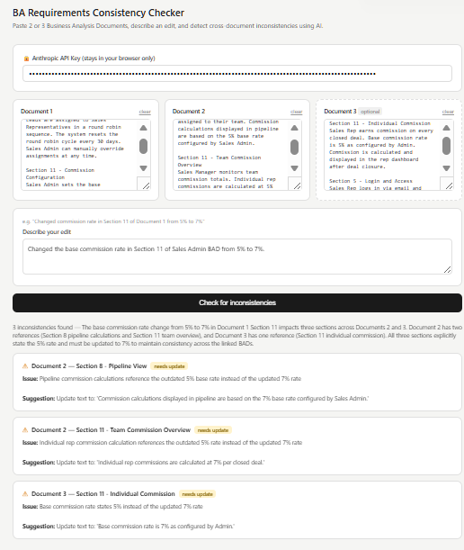

# ba-consitency-checker
AI-powered tool that detects cross-document inconsistencies across linked Business Analysis Documents (BADs) using the Claude API. Built to solve a real BA problem — requirements drift across multi-role system documentation.
# BA Requirements Consistency Checker

An AI-powered tool that detects cross-document inconsistencies across linked Business Analysis Documents (BADs) using the Claude API.

## The Problem

When maintaining multiple linked BA documents (e.g. Sales Admin, Sales Manager, Sales Rep), a single change in one document can create silent inconsistencies in the others. Manually scanning all documents after every edit is time-consuming and error-prone.

## The Solution

Paste 2 or 3 BADs, describe your edit, and the tool instantly flags every section across all documents that needs updating — with specific suggestions for each fix.

## Demo

## How to Use

1. Download `Requirements_Consistency_Checker_BA.html`
2. Open it in any browser
3. Enter your Anthropic API key (get one at console.anthropic.com)
4. Paste content from 2 or 3 BA documents
5. Describe the edit you made
6. Click Check for inconsistencies

## Tech Stack

- HTML / CSS / JavaScript (single file, no dependencies)
- Anthropic Claude API (claude-sonnet-4-5)

## Use Case

Built for Business Analysts managing multi-role system documentation where business rules, calculations, and logic are shared across linked documents.

## Author

Samyak Pratap Shah — [LinkedIn](https://linkedin.com/in/samyakpratapshah) | [GitHub](https://github.com/samyakcfc)
